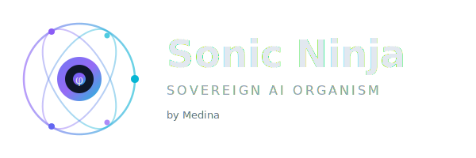

<p align="center">
  
</p>

<p align="center">
  <a href="https://github.com/FreddyCreates/potential-succotash/actions/workflows/ci.yml"></a>
  <a href="https://github.com/FreddyCreates/potential-succotash/actions/workflows/build-extensions.yml"></a>
  <a href="https://github.com/FreddyCreates/potential-succotash/actions/workflows/deploy-pages.yml"></a>
  <a href="https://github.com/FreddyCreates/potential-succotash/actions/workflows/deploy-workers.yml"></a>
  
  
  
  
  
  
  
  
  
  
</p>

<p align="center">
  <strong>Your personal AI that lives in your browser — no cloud, no subscription, no data leaves your device.</strong>
</p>

<p align="center">
  <a href="#get-started">🚀 Get Started</a> · <a href="#what-can-it-do">✨ What Can It Do</a> · <a href="#download">⬇ Download</a> · <a href="#how-it-works">⚙️ How It Works</a> · <a href="#for-developers">👩‍💻 For Developers</a>
</p>

---

## Meet Sonic Ninja

**Sonic Ninja** is a sovereign AI platform built by Medina. It gives you a full AI assistant — research agents, memory systems, security scanning, offline inference — entirely on your machine. No API keys. No monthly fees. No data sent anywhere.

Think of it as **your own AI operating system** that runs as a browser side panel, a desktop app, or a set of intelligent services — all self-contained, all private.

> *Vigil (Latin): watchfulness, wakefulness — the state of being alert and observant.*

---

<a id="get-started"></a>
## 🚀 Get Started in 60 Seconds

### Option 1: Browser Extension (Easiest)

1. **Download** → [Sonic Ninja ZIP](https://github.com/FreddyCreates/potential-succotash/raw/main/dist/extensions/jarvis.zip)
2. **Unzip** the file anywhere on your computer
3. **Open** Chrome or Edge → go to `chrome://extensions` (or `edge://extensions`)
4. **Turn on** "Developer Mode" (toggle in the top-right)
5. **Click** "Load unpacked" → select the unzipped folder
6. **Pin it** → click the 🧩 puzzle piece in your toolbar → pin Sonic Ninja
7. **Open** → press `Ctrl+Shift+Y` or click the icon

**That's it. You're running sovereign AI.**

### Option 2: Windows One-Click Install

Download [`install-jarvis-edge.bat`](https://github.com/FreddyCreates/potential-succotash/raw/main/install-jarvis-edge.bat) → right-click → **Run**. Done.

### Option 3: Desktop App (Windows / macOS / Linux)

```bash
git clone https://github.com/FreddyCreates/potential-succotash.git
cd potential-succotash
npm run build:desktop
```

Produces a native installer for your platform in `dist/desktop/`.

### Option 4: Command Line (organism-cli)

```bash
git clone https://github.com/FreddyCreates/potential-succotash.git
cd potential-succotash
node organism-cli status    # Check system health
node organism-cli list      # List all components
node organism-cli install   # Install extensions locally
```

---

<a id="what-can-it-do"></a>
## ✨ What Can It Do

### For You (End Users)

| What you want | How Sonic Ninja helps |
|---|---|
| **Summarize articles** | Open any page → Solus summarizes it offline, instantly |
| **Ask questions about what you're reading** | Highlight text → ask a question → get an answer from the page |
| **Remember everything** | Every page you save goes into a Memory Palace — find it later by topic, not keywords |
| **Stay safe online** | Sentry scans pages in real-time for phishing, malware, and suspicious content |
| **Research anything** | Deploy autonomous agents that crawl, scrape, and synthesize information for you |
| **Organize knowledge** | The Knowledge Graph maps everything you read into a visual web of connections |
| **Take notes & annotate** | Highlight, annotate, journal, and export — all stored locally |
| **Generate reports** | Create PDF and Excel reports from your research with one click |
| **Manage tabs & files** | Built-in tab manager, file viewer, and document handler |
| **Work offline** | All core AI runs without internet after the first model download (~80 MB) |

### The 22 Panels

Open the side panel and you have immediate access to:

| | | | |
|---|---|---|---|
| 💬 Chat | ⚡ Nexus | 🔵 Solus | 📥 Inbox |
| 📌 Highlights | 🪞 Mirror | 🏛 Memory | 🛡 Sentry |
| 🗺 Graph | 🤖 Agents | ⚗️ AGI Tools | 📓 Journal |
| 📁 Files | 🔐 Vault | 💡 Prompts | 📝 Workspace |
| 🔧 Tools | 🔍 Search | 🖥️ Screen | 🗂️ Tabs |
| ⬇ Install | 📋 Log | | |

### Autonomous Agents

Say "research quantum computing" or "crawl this site" and Sonic Ninja deploys agents that work independently:

- **Researcher** — pulls from Wikipedia + domains, parallel synthesis
- **Crawler** — spiders from a URL, follows links, extracts content
- **Scraper** — tables, lists, prices, dates → structured data
- **Scout** — deep scan + full link map
- **Digest** — multi-topic synthesis reports
- **Monitor** — watches sites for changes
- **Analyst** — parallel multi-URL comparison
- **Sweep** — batch extraction across sites

---

<a id="download"></a>
## ⬇ Download

| Package | Platform | Link |
|---|---|---|
| **Sonic Ninja Extension** | Chrome / Edge | [⬇ jarvis.zip](https://github.com/FreddyCreates/potential-succotash/raw/main/dist/extensions/jarvis.zip) |
| **All 41 Extensions Pack** | Chrome / Edge | [⬇ all-extensions.zip](https://github.com/FreddyCreates/potential-succotash/raw/main/dist/extensions/all-extensions.zip) |
| **Windows Installer** | Windows | [⬇ install-jarvis-edge.bat](https://github.com/FreddyCreates/potential-succotash/raw/main/install-jarvis-edge.bat) |
| **Organism Installer** | Windows | [⬇ install-organism.bat](https://github.com/FreddyCreates/potential-succotash/raw/main/install-organism.bat) |
| **Organism Installer** | macOS / Linux | [⬇ install-organism.sh](https://github.com/FreddyCreates/potential-succotash/raw/main/install-organism.sh) |
| **Desktop App** | Windows / macOS / Linux | Build from source (see above) |

### Extension Library

We ship **41 browser extensions** covering AI, security, productivity, research, and creativity:

<details>
<summary>📦 View full extension list</summary>

| Category | Extensions |
|---|---|
| **Core Intelligence** | Sonic Ninja (Jarvis), Sovereign Mind, Sovereign Nexus, Sovereign Command Pilot |
| **Research & Knowledge** | Knowledge Cartographer, Research Nexus, Data Oracle, Data Alchemist |
| **Security & Defense** | Sentinel Watch, Cipher Shield, CI Pilot Embodied |
| **Creativity** | Creative Muse, Vision Weaver, Video Architect, Voice Forge |
| **Development** | Code Sovereign, Contract Forge, Logic Prover, Pattern Forge |
| **Edge AI** | Edge AI Assistant, Edge Context Engine, Edge Prompt Lab, Edge Runner, Edge Tab Analyzer |
| **Windows Native** | Windows Copilot Hub, Windows File Oracle, Windows Notification Cortex, Windows Shell Intelligence, Windows Terminal Forge |
| **Productivity** | Screen Commander, Social Cortex, Spread Scanner, Polyglot Oracle |
| **Infrastructure** | Marketplace Hub, Protocol Bridge, Organism Dashboard, Memory Palace |
| **Economy** | Sovereign Alpha, Law Firm Economy Counsel |

</details>

---

## 🔵 Solus — Your Offline AI

Solus is the AI engine at the heart of Sonic Ninja. It runs **100% in your browser** — no server, no API key, no internet needed after setup.

### What it does

| Mode | What happens |
|---|---|
| 📄 **Summarize** | Feed it any article → get a concise summary instantly |
| 🏷 **Classify** | Categorize any text against labels you define — zero training needed |
| ❓ **Ask** | Ask questions about page content → answers come from the text, no hallucination |

### First-time setup

1. Open Sonic Ninja → click the **🔵 Solus** tab
2. Click **⚡ Activate Solus** — downloads models once (~80 MB), cached permanently
3. That's it. Solus works offline forever after this.

### Models used
- Summarization: `Xenova/distilbart-cnn-6-6`
- Classification: `Xenova/nli-deberta-v3-small`
- Question Answering: `Xenova/distilbert-base-uncased-distilled-squad`

---

<a id="how-it-works"></a>
## ⚙️ How It Works

### The Organism Architecture

Sonic Ninja isn't just one extension — it's a living system:

```
┌─────────────────────────────────────────────────────────┐
│                    SONIC NINJA ORGANISM                   │
├─────────────┬──────────────┬──────────────┬─────────────┤
│  41 Browser │  19 SDKs     │  11 Workers  │  Desktop    │
│  Extensions │              │  (Cloudflare)│  App        │
├─────────────┴──────────────┴──────────────┴─────────────┤
│              11 Sovereign Protocols                       │
├─────────────────────────────────────────────────────────┤
│         Phi-Mathematics Core (φ = 1.618...)              │
│         NeuroCore (873ms heartbeat)                       │
│         Memory Temple SDK                                │
└─────────────────────────────────────────────────────────┘
```

### Core Engines

| Engine | Purpose |
|---|---|
| **Solus** | Offline AI inference (Transformers.js) — summarize, classify, Q&A |
| **NeuroCore** | Phi-encoded heartbeat oscillator — mood, focus, awareness tracking |
| **PatternSynthesis** | 40 cognitive primitives across 8 knowledge domains |
| **Memory Palace** | 5D phi-encoded spatial memory — retrieval by conceptual resonance |
| **SentryAI** | Real-time threat detection — phishing, PII, injection, malware |
| **Cartographer** | Knowledge graph — entity extraction + force-directed visualization |
| **CrawlFetcher** | Parallel agent fetch engine — HTML stripping, diffing, extraction |

### The φ (Phi) Mathematics

Everything in the organism is built on golden-ratio mathematics:
- **Heartbeat**: 873ms (because 873 × φ ≈ 1413ms — a recursive phi interval)
- **Memory encoding**: 5D coordinates (θ, φ, ρ, ring, beat)
- **Thresholds**: 0.618 (1/φ) for pattern confidence
- **Decay**: Hebbian weights decay by φ⁻¹ per cycle

---

<a id="for-developers"></a>
## 👩‍💻 For Developers

### Quick Setup

```bash
git clone https://github.com/FreddyCreates/potential-succotash.git
cd potential-succotash
```

### Commands

| Command | What it does |
|---|---|
| `npm run lint` | Validate all 40 extension manifests |
| `npm test` | Run full test suite (15,410 tests) |
| `npm run build` | Build all extension ZIPs to `dist/` |
| `npm run build:desktop` | Build native desktop app |
| `npm run build:all` | Build everything |
| `node organism-cli status` | System health check |
| `node organism-cli list` | List all organism components |
| `node organism-cli validate` | Validate organism integrity |

### Test Results

```
✔ Tests:     15,410 passing
✔ Suites:    795
✔ Lint:      40/40 manifests valid
✔ Duration:  ~3.2s
```

### Project Structure

```
potential-succotash/
├── extensions/          → 41 browser extensions (Chrome/Edge)
├── sdk/                 → 19 SDKs (agents, engines, runtime, enterprise)
├── workers/             → 11 Cloudflare Workers (AI, coordinators, honeypots)
├── protocols/           → 11 sovereign protocols (P226, phi-verification, etc.)
├── memory_temple/       → CIVOS-PRIME memory SDK
├── defense-organism/    → Dual-layer security (cortex + subcortex)
├── desktop/             → Electron desktop app
├── organism-cli/        → CLI management tool
├── functions/           → Cloudflare Pages Functions
├── governance/          → Organism governance framework
├── research/            → Research papers and theory
├── docs/                → Architecture docs and reports
├── test/                → 795 test suites (15,410 tests)
└── scripts/             → Build, deploy, and automation scripts
```

### SDKs Available

| SDK | Purpose |
|---|---|
| `organism-runtime-sdk` | Core organism runtime |
| `sovereign-memory-sdk` | Phi-encoded memory operations |
| `intelligence-routing-sdk` | AI model routing and dispatch |
| `enterprise-integration-sdk` | Enterprise system connectors |
| `windows-desktop-sdk` | Windows-native AI integration |
| `windows-runtime-sdk` | Windows runtime hooks |
| `medina-calls` | Callable AI tool definitions |
| `medina-queries` | Query engine SDK |
| `medina-timers` | Phi-interval timer utilities |
| `ai-model-engines` | Model pipeline management |
| `frontend-intelligence-models` | Browser-side AI models |
| `document-absorption-engine` | Document parsing + ingestion |
| `organism-marketplace` | Extension marketplace SDK |
| `organism-bootstrap` | Organism initialization |
| `register-ai` | AI registry management |
| `agents` | Autonomous agent framework |
| `engines` | Core computation engines |
| `runtime` | Shared runtime utilities |

### Cloudflare Workers

11 intelligent edge workers handling AI inference, coordination, honeypots, and knowledge management — all deployed on Cloudflare's global network.

### CI/CD Pipeline

Automated through GitHub Actions:
- **CI** — Lint + test on Node 18, 20, 22 (every push/PR)
- **Build Extensions** — Auto-build and commit extension ZIPs
- **Deploy Pages** — Live site deployment
- **Deploy Workers** — Edge worker deployment
- **Release** — Automated release packaging
- **25 Organism Bots** — Autonomous maintenance, learning, and governance

---

## 🛡️ Security & Privacy

- **Zero telemetry** — no analytics, no tracking, no phone-home
- **Local-first** — all data stays in your browser's IndexedDB and chrome.storage
- **Offline AI** — Solus runs entirely on-device after initial model download
- **SentryAI** — active protection against phishing, PII exposure, and prompt injection
- **Defense Organism** — dual-layer security architecture (conscious cortex + dark subcortex)
- **Honeypot network** — detects and catalogs attack patterns at the edge

---

## 📜 License

[MIT](LICENSE) — Free for personal and commercial use.

---

## 🤝 Contributing

See [CONTRIBUTING.md](CONTRIBUTING.md) for guidelines.

---

<p align="center">
  
</p>

<p align="center">
  <strong>Built by Medina</strong><br/>
  <em>React · TypeScript · Vite · Zustand · Dexie.js · Transformers.js · Cloudflare Workers · Electron</em>
</p>
