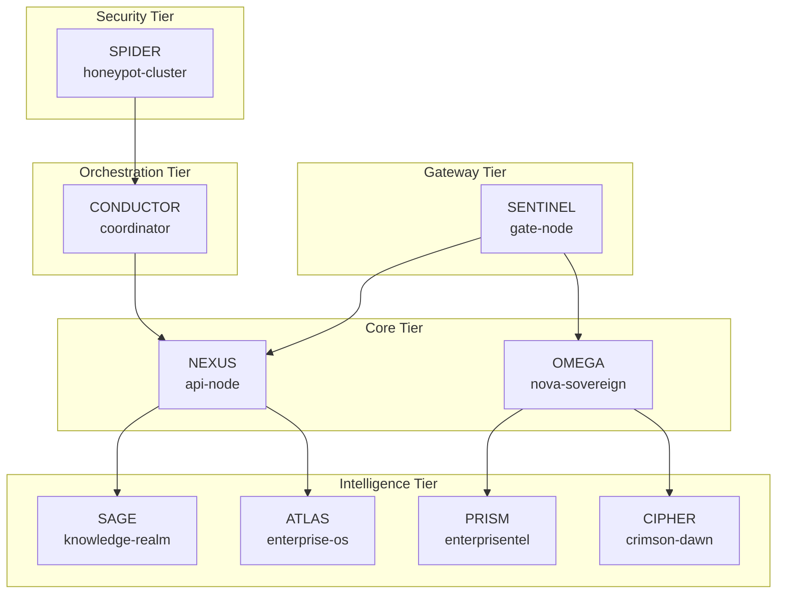

# Nova Clean Internet Protocol - Architecture Documentation

> **Multi-Tier Intelligent Architecture for the Clean Internet**

## Overview

The Nova Clean Internet Protocol implements a distributed intelligence architecture through **9 Intelligent Divisions** - specialized Cloudflare Workers operating in harmonic coherence via φ-constants (Golden Ratio mathematics).

## Architecture Diagram

```
                         ╔═══════════════════════════════════════╗
                         ║     🌐 CLEAN INTERNET GATEWAY         ║
                         ╚═══════════════════════════════════════╝
                                          │
                    ┌─────────────────────┼─────────────────────┐
                    ▼                     ▼                     ▼
        ╔═══════════════════╗ ╔═══════════════════╗ ╔═══════════════════╗
        ║   GATE-NODE       ║ ║   API-NODE        ║ ║  NOVA-SOVEREIGN   ║
        ║   [SENTINEL]      ║ ║   [NEXUS]         ║ ║  [OMEGA]          ║
        ║   Auth/Crypto     ║ ║   Tool Hub        ║ ║  Command Center   ║
        ║   Routing         ║ ║   Fast+Deep Brain ║ ║  Protocol Core    ║
        ╚═══════════════════╝ ╚═══════════════════╝ ╚═══════════════════╝
                    │                     │                     │
        ┌───────────┴─────────────────────┴─────────────────────┴───────────┐
        ▼                     ▼                     ▼                       ▼
╔═══════════════════╗ ╔═══════════════════╗ ╔═══════════════════╗ ╔═══════════════════╗
║  KNOWLEDGE-REALM  ║ ║ ENTERPRISE-OS-INT ║ ║ ENTERPRISENTEL    ║ ║   CRIMSON-DAWN    ║
║  [SAGE]           ║ ║ [ATLAS]           ║ ║ [PRISM]           ║ ║   [CIPHER]        ║
║  RAG/Memory       ║ ║ OS Architecture   ║ ║ Innovation Engine ║ ║   Deep Processing ║
╚═══════════════════╝ ╚═══════════════════╝ ╚═══════════════════╝ ╚═══════════════════╝
                                    │
                    ┌───────────────┼───────────────┐
                    ▼               ▼               ▼
        ╔═══════════════════════════════════════════════════════╗
        ║              HONEYPOT CLUSTER [SPIDER]                ║
        ║   honeypot-admin │ honeypot-portal │ probe-node       ║
        ╚═══════════════════════════════════════════════════════╝
                                    │
                                    ▼
        ╔═══════════════════════════════════════════════════════╗
        ║           COORDINATOR [CONDUCTOR]                     ║
        ║           Queue Consumer / Workflow Orchestration     ║
        ╚═══════════════════════════════════════════════════════╝
```

## φ-Constants (Golden Ratio Coherence)

All divisions operate on universal harmonic constants:

| Constant | Value | Purpose |
|----------|-------|---------|
| `PHI` | 1.618033988749895 | Golden Ratio - harmonic scaling |
| `HEARTBEAT_MS` | 873 | System pulse interval (ms) |

## The 9 Intelligent Divisions

### 1. SENTINEL (gate-node) - Port 8789
**Role:** Authentication, Cryptography, Intelligent Routing

| Binding | Resource |
|---------|----------|
| AI | @cf/meta/llama-3.1-8b-instruct |
| KV | SESSION_STORE, IP_BLOCKLIST |
| D1 | medinatech-db |
| Vectorize | medinatech-index |
| Queue | honeypot-events |
| R2 | medinatech-assets |

### 2. NEXUS (api-node) - Port 8787
**Role:** Tool Hub with Fast Brain + Deep Brain architecture

| Binding | Resource |
|---------|----------|
| AI | Full AI binding |
| KV | All namespaces |
| D1 | medinatech-db |
| Vectorize | medinatech-index |
| Queue | honeypot-events, ai-analysis |
| R2 | medinatech-assets |
| Durable Objects | RateLimiter, SessionManager |

### 3. OMEGA (nova-sovereign) - Port 8791
**Role:** Protocol Core, Command Authority

| Binding | Resource |
|---------|----------|
| AI | Full AI binding |
| D1 | medinatech-db |
| Durable Objects | ProtocolState |

### 4. SAGE (knowledge-realm) - Port 8790
**Role:** RAG, Memory, Learning Systems

| Binding | Resource |
|---------|----------|
| AI | Full AI binding |
| KV | KNOWLEDGE_CACHE |
| D1 | medinatech-db |
| Vectorize | medinatech-index |

### 5. ATLAS (enterprise-os-intelligence) - Port 8792
**Role:** OS Architecture Layer

| Binding | Resource |
|---------|----------|
| AI | Full AI binding |
| KV | CONFIG_STORE |
| D1 | medinatech-db |

### 6. PRISM (enterprisentelligence) - Port 8793
**Role:** Innovation Engine

| Binding | Resource |
|---------|----------|
| AI | Full AI binding |
| D1 | medinatech-db |
| Vectorize | medinatech-index |

### 7. CIPHER (crimson-dawn-4f6d) - Port 8794
**Role:** Deep Processing, Crypto, Intelligence

| Binding | Resource |
|---------|----------|
| AI | Full AI binding |
| D1 | medinatech-db |
| R2 | medinatech-assets |

### 8. SPIDER (Honeypot Cluster) - Ports 8795-8797
**Role:** Threat Detection & Deception Network

**Sub-Intelligences:**
- `honeypot-admin` (8795) - Administrative control
- `honeypot-portal` (8796) - Decoy interface
- `probe-node` (8797) - Active scanning

| Binding | Resource |
|---------|----------|
| AI | Full AI binding |
| KV | HONEYPOT_LOGS, THREAT_INTEL, SCAN_PATTERNS |
| D1 | medinatech-db |
| Queue | honeypot-events |

### 9. CONDUCTOR (coordinator) - Port 8788
**Role:** Queue Consumer, Workflow Orchestration

| Binding | Resource |
|---------|----------|
| AI | Full AI binding |
| D1 | medinatech-db |
| Queue | honeypot-events (consumer) |
| Durable Objects | WorkflowState, TaskQueue, EventProcessor |

## Inter-Division Communication



## Shared Resources

| Resource Type | Name | Used By |
|---------------|------|---------|
| D1 Database | medinatech-db | All Divisions |
| Vectorize Index | medinatech-index | SENTINEL, NEXUS, SAGE, PRISM |
| R2 Bucket | medinatech-assets | SENTINEL, NEXUS, CIPHER |
| Queue | honeypot-events | SENTINEL, NEXUS, SPIDER → CONDUCTOR |
| Queue | ai-analysis | NEXUS |

## Intelligence Levels

| Level | Description | Example Divisions |
|-------|-------------|-------------------|
| Stateless | No persistence | - |
| Basic | KV only | ATLAS |
| Memory | KV + D1 | SAGE |
| Knowledge | KV + D1 + Vectorize | SENTINEL |
| Intelligent | Full stack | NEXUS |
| Fully Bound | Full stack + Durable Objects | OMEGA, CONDUCTOR |

---

*Nova Protocol - Building the Clean Internet through Distributed Intelligence*
